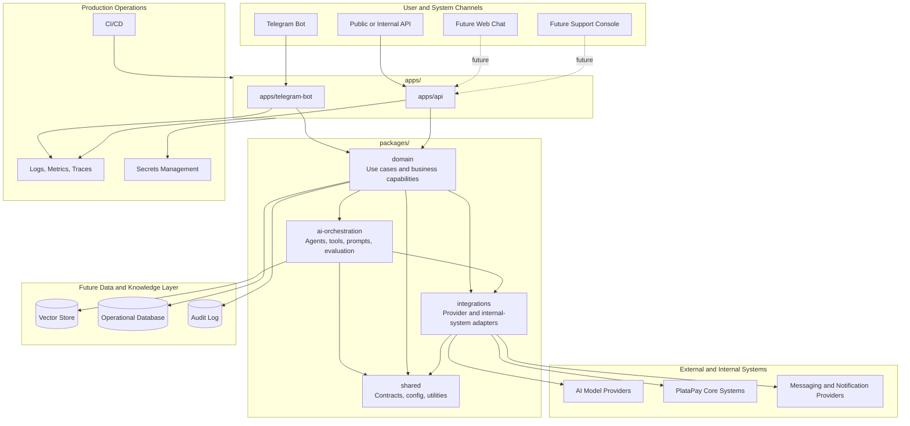

# PlataPay AI System Context

This document describes the intended production architecture for PlataPay AI at a high
level. It is a target foundation, not an implementation of business logic.

## Architecture Diagram

## Intended Boundaries

### Channels and Applications

Applications are deployable entrypoints. They should handle protocol details,
authentication boundaries, request validation, and response formatting. They should not
own PlataPay business rules.

### Domain Package

The domain package is the future home for business capabilities, use cases, policies,
and domain events. It should stay independent from Telegram, HTTP frameworks, databases,
and AI provider SDKs.

### AI Orchestration Package

The AI orchestration package is the future home for prompts, agent workflows, retrieval,
tool execution policies, model routing, and evaluation hooks. It should expose stable
interfaces to the domain layer and avoid leaking provider-specific SDKs.

### Integrations Package

The integrations package is the future home for adapters to PlataPay systems, AI
providers, messaging providers, databases, vector stores, and third-party services.

### Infrastructure

Infrastructure assets belong under `infra/`. Runtime configuration should be explicit,
environment-driven, and compatible with CI/CD and secret management.

## Professional Architecture Recommendations

- Start with a modular monorepo instead of multiple repositories. This keeps
  early platform boundaries visible while avoiding premature distributed-system
  complexity.
- Keep Telegram as an adapter, not the core. This prevents a bot-first architecture from blocking future channels.
- Define contracts before implementation. API schemas, use-case interfaces, and
  integration boundaries should be reviewed before business logic is added.
- Add observability and security controls before production traffic. AI systems
  need auditability, prompt/tool permission controls, and traceable decisions.
