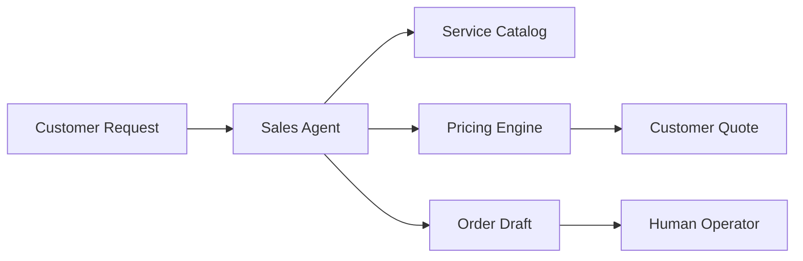

# PlataPay AI OS Product Vision

PlataPay AI OS is the business operating layer for helping customers request payment support for foreign digital services. The first platform capability is a Sales Agent connected to a Pricing Engine and an Orders workflow.

## Product Goal

Create a controlled AI-assisted intake experience that can:

- understand which digital service and plan the customer wants;
- calculate a customer-facing final price using internal pricing policy;
- collect only the minimum safe information needed to continue;
- create a structured order for a human operator;
- keep sensitive pricing, payment, and operational rules out of customer-facing messages.

## First Business Capability

The first capability is not a Telegram bot. It is a reusable business core that can later be used by Telegram, web chat, API, CRM, or operator tools.

## Non-Goals for This Stage

- No real payment execution.
- No connection to external payment APIs.
- No Telegram bot implementation.
- No collection of production customer credentials.
- No promise of guaranteed payment success.
